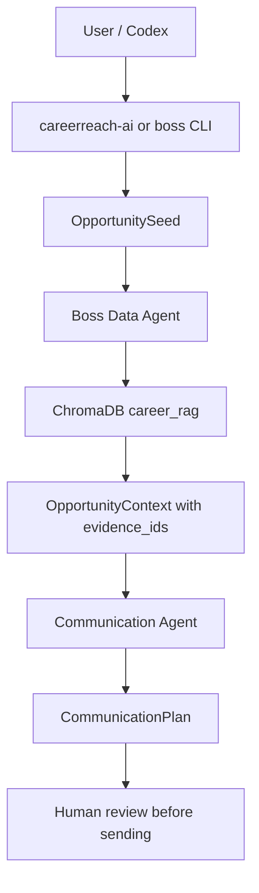

# CareerReach AI

CareerReach AI is a local, evidence-backed job-search communication system.
It wraps a two-agent workflow around `boss-agent-cli`:

1. **Boss Data Agent** collects company, job, resume, playbook, and direct context evidence.
2. **Communication Agent** turns that evidence into traceable outreach drafts and follow-up plans.

The repository is designed to run locally. It does not include real login
sessions, cookies, private resumes, chat history, or platform caches.

## Repository Layout

```text
careerreach-ai/
  .agents/                         Codex skill metadata
  docs/                            Architecture, product, and safety notes
  examples/                        Public mock inputs and memory examples
  scripts/                         Demo and setup scripts
  src/careerreach_ai/              Wrapper CLI and output contract checks
  tests/                           Wrapper tests
  third_party/boss-agent-cli/      Vendored MIT-licensed CLI/tool layer
```

## What Is Included

- `careerreach-ai`: wrapper CLI, fixture backend, boss CLI adapter, output validation, redaction checks.
- `third_party/boss-agent-cli`: the local tool layer used for search, RAG, resume storage, and the two-agent communication workflow.
- Public examples for resume RAG and outreach playbook memory.
- Setup scripts for Windows and macOS/Linux.

## What Is Not Included

The following must stay local and must not be committed:

- BOSS/Zhipin login sessions, cookies, QR login state, browser profiles.
- Real chat history, recruiter messages, contact IDs, platform security IDs.
- Private resumes with phone/email unless you intentionally publish them.
- Local ChromaDB databases and generated Excel outputs.

## Quick Start on Windows

```powershell
cd careerreach-ai
.\scripts\setup.ps1
.\.venv\Scripts\Activate.ps1
careerreach-ai --backend fixture --input examples\mock_opportunity.json --pretty
```

## Quick Start on macOS/Linux

```bash
cd careerreach-ai
bash scripts/setup.sh
source .venv/bin/activate
careerreach-ai --backend fixture --input examples/mock_opportunity.json --pretty
```

## Run the Local RAG Flow

Start ChromaDB in one terminal:

```powershell
.\.venv\Scripts\chroma.exe run --path .data\rag\chroma-server --host 127.0.0.1 --port 8000
```

Then in another terminal:

```powershell
$env:BOSS_RAG_CHROMA_URL = "http://127.0.0.1:8000"
boss --data-dir .data --json rag index-resume --input examples\public_resume.example.json
boss --data-dir .data --json rag index-outreach-playbook --input examples\public_outreach_playbook.example.json
boss --data-dir .data --json rag search "AI customer service Agent Dify" --doc-type resume --top-k 5
```

Generate an evidence-backed communication plan:

```powershell
boss --data-dir .data --json ai communication plan `
  --company "Demo AI" `
  --job-title "AI Product Manager" `
  --context "job_requirement: AI customer service, Dify workflow, Agent product design" `
  --mode rules `
  --use-rag `
  --no-save
```

## Resume Memory Design

The resume is stored twice, for different purposes:

- As structured JSON under a user's local resume store.
- As searchable RAG chunks in ChromaDB with `doc_type=resume`.

When indexed, each resume is split into traceable chunks:

```json
{
  "chunk_id": "resume:sample_ai_pm:row:<digest>",
  "text": "module_title: Project Experience\nexperience: Built a Dify workflow...",
  "metadata": {
    "source": "resume_store",
    "doc_type": "resume",
    "chunk_kind": "resume_experience",
    "resume_name": "sample_ai_pm",
    "module_title": "Project Experience"
  }
}
```

The Communication Retriever always searches:

1. Outreach playbook memory.
2. Resume evidence, filtered by `doc_type=resume`.
3. Company/job evidence, filtered by `company` or `job_id`.

This lets the Boss Data Agent answer: "Which part of the resume matches this JD?"
The Communication Agent then uses those evidence IDs when drafting.

## Two-Agent Workflow



## Safety Boundary

This project can generate outreach drafts and local planning artifacts. It
should not bypass platform verification, abnormal-environment checks, account
risk controls, login requirements, or manual confirmation for sending messages.

## Tests

```powershell
.\.venv\Scripts\python.exe -m pytest tests third_party\boss-agent-cli\tests\test_communication_agent.py -q
```

## Third-Party Notice

`boss-agent-cli` is included under `third_party/boss-agent-cli` for convenience.
It is MIT licensed by its original author. See:

- `third_party/boss-agent-cli/LICENSE`
- `THIRD_PARTY_NOTICES.md`
