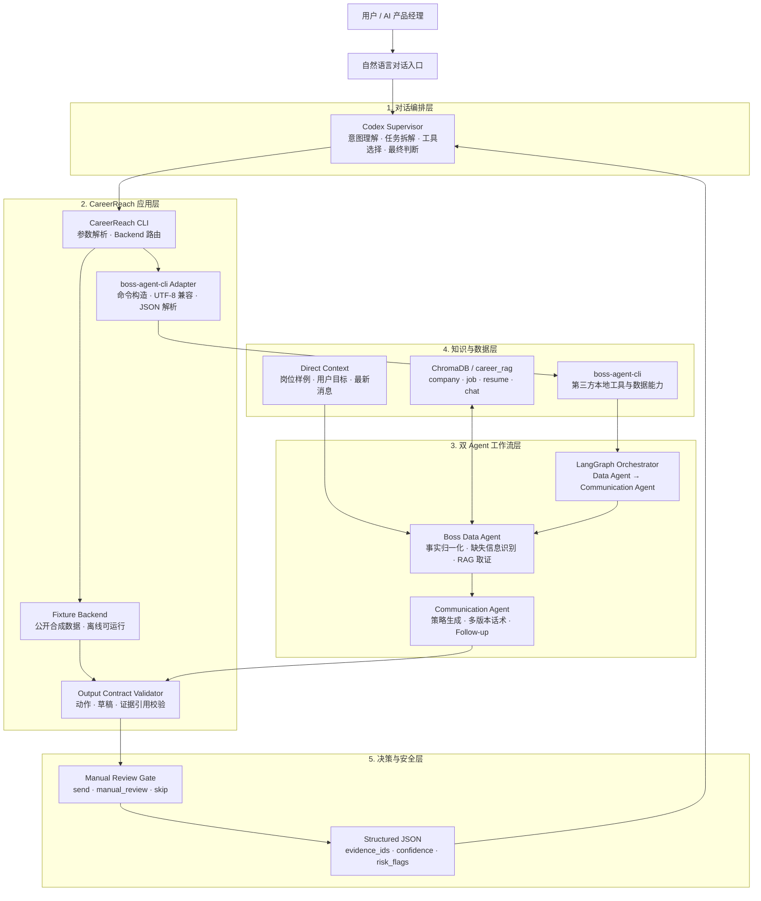
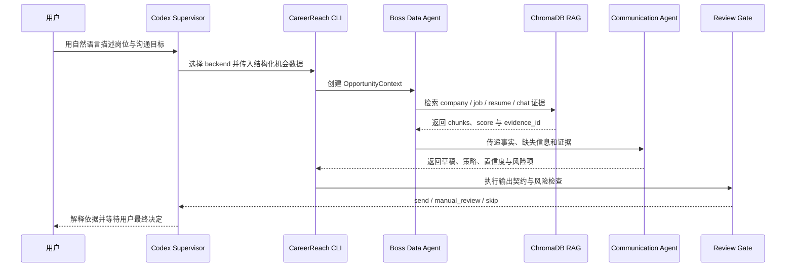

<div align="center">

# CareerReach AI

### 面向求职沟通场景的证据驱动型多 Agent 协作原型

通过自然语言完成岗位信息整理、个人经历匹配、RAG 证据检索、沟通策略生成与人工风险审核。


[项目定位](#项目定位) · [系统架构](#系统架构) · [Agent 分工](#agent-分工) · [技术实现](#技术实现) · [快速运行](#快速运行) · [安全边界](#安全与隐私边界)

</div>

---

## 项目定位

CareerReach AI 是一个面向 AI 产品经理求职场景设计的 Agent 产品原型。它以自然语言对话作为主要入口，把原本分散的公司信息、岗位要求、简历经历和沟通上下文组织成一条可追溯的证据链，并生成结构化的沟通建议。

项目希望解决的不是“如何自动批量投递”，而是以下更具体的问题：

- 面对一个岗位，如何快速提炼真正影响匹配判断的公司与 JD 信息？
- 如何从个人经历中找到能够支撑沟通内容的证据，而不是生成通用话术？
- 如何让不同 Agent 分工完成事实整理与策略生成，同时保留可解释的中间结果？
- 当信息不足、证据稀疏或动作敏感时，如何让系统主动进入人工审核？

因此，CareerReach AI 的核心产物不是一段孤立文案，而是一个包含 `context`、`evidence_ids`、`drafts`、`confidence`、`risk_flags` 和 `recommended_action` 的完整沟通决策包。

> 本项目基于第三方开源项目 [`boss-agent-cli`](https://github.com/can4hou6joeng4/boss-agent-cli) 提供的本地工具与双 Agent 工作流进行产品化封装。CareerReach AI 主要展示上层对话式交互、Agent 编排、证据链设计、输出契约、风险控制与公开 Demo 工程化能力。

## 核心能力

| 能力 | 说明 | 对用户的价值 |
| --- | --- | --- |
| 自然语言任务编排 | Codex Supervisor 理解用户目标，选择 Demo 或真实 CLI backend，并解释执行结果 | 用户不需要记忆复杂命令 |
| 岗位上下文建模 | 将公司、岗位、沟通目标、最新消息和补充事实整理为统一的 `OpportunityContext` | 把零散求职信息变成可处理的数据结构 |
| 多 Agent 协作 | Boss Data Agent 负责事实与证据，Communication Agent 负责策略、话术和跟进计划 | 降低单一 Agent 同时“找事实又写答案”带来的混淆 |
| RAG 证据增强 | 通过 ChromaDB 检索公司、岗位、简历和历史沟通内容，并保留 `evidence_id` | 让每条核心建议可以回溯到依据 |
| 沟通决策生成 | 输出多种风格的草稿、推荐动作、置信度、风险项和 follow-up 计划 | 不只生成一句话，而是给出完整行动建议 |
| Human-in-the-loop | 用 `send`、`manual_review`、`skip` 表达决策结果，敏感动作停在人工确认之前 | 在效率和求职沟通风险之间建立边界 |
| 结构化结果契约 | 所有 backend 统一返回 JSON，并通过契约校验器检查关键字段 | 便于未来接入 Web、MCP、工作流平台或评测系统 |
| 可降级演示 | 默认 Fixture backend 不依赖登录、Cookie、外部模型或 ChromaDB | HR 或面试官克隆后即可快速查看结果 |

## 系统架构

CareerReach AI 采用“对话编排层—应用适配层—Agent 工作流层—知识与数据层—安全输出层”的分层结构。



### 分层说明

| 层级 | 主要职责 | 本仓库中的实现 |
| --- | --- | --- |
| 对话编排层 | 理解自然语言意图、选择工具、检查结果、做最终风险判断 | Codex 作为外部 Supervisor 使用本仓库 CLI；它不是仓库内伪装的模型 API |
| CareerReach 应用层 | 把输入转成稳定命令，在 Fixture 与真实 CLI backend 之间路由 | `cli.py`、`boss_cli.py`、`fixture_agent.py` |
| 双 Agent 工作流层 | 先收集事实，再生成沟通策略；避免两个职责相互污染 | 由 `boss-agent-cli` 的 Communication Workflow 提供 |
| 知识与数据层 | 保存或检索公司、岗位、简历、聊天等求职上下文 | ChromaDB RAG 与直接输入；公开仓库只包含合成数据 |
| 决策与安全层 | 验证输出完整性、标注风险、控制敏感动作 | `contracts.py`、`redaction.py` 与人工审核规则 |

## Agent 分工

这个系统有两个执行型 Agent 和一个上层 Supervisor。三者职责相互独立：

### 1. Codex Supervisor

Codex 是自然语言协作入口和最终编排者，主要负责：

- 理解用户是在做岗位分析、首次沟通、回复建议还是后续跟进；
- 选择 Fixture backend 或 `boss-agent-cli` backend；
- 读取结构化 JSON，而不是依赖不可验证的自然语言输出；
- 检查 `missing_info`、`risk_flags`、`confidence` 和 `evidence_ids`；
- 对结果做解释、比较和最终风险判断；
- 在任何敏感平台动作之前保留用户确认。

这里的 Codex 是上层模型与编排环境，`boss-agent-cli` 是被调用的本地工具/数据层。项目没有把 Codex 描述为一个可由 CLI 直接调用的 OpenAI-compatible API。

### 2. Boss Data Agent

Boss Data Agent 是事实层 Agent，只负责构造可供决策使用的 `OpportunityContext`：

- 归一化公司名称、岗位名称、沟通目标和最新消息；
- 整理用户直接提供的公司事实、JD 判断和简历证据；
- 在开启 RAG 时从 ChromaDB 检索相关上下文；
- 为证据分配并保留 `evidence_id`；
- 标记公司、岗位或证据缺失等 `missing_info`；
- 将结构化上下文交给 Communication Agent，不直接承担话术创作。

### 3. Communication Agent

Communication Agent 只基于已经整理好的上下文生成行动方案：

- 判断推荐动作：`send`、`manual_review` 或 `skip`；
- 生成不同表达风格的沟通草稿；
- 为每个草稿附上使用过的 `evidence_ids`；
- 解释 `why_this_works`，说明话术设计依据；
- 生成 follow-up 节奏和下一步建议；
- 输出 `confidence` 与 `risk_flags`，为人工判断提供信号。

### 4. Manual Review Gate

Manual Review Gate 不是另一个生成式 Agent，而是产品级决策边界：

- `send`：当前证据相对完整，可以作为候选草稿供用户采用；
- `manual_review`：信息不足、证据稀疏或存在风险，需要人工修改或补充；
- `skip`：不建议继续本次触达。

即使结果为 `send`，它也表示“建议采用该草稿”，不代表系统会自动在招聘平台发送消息。

## 端到端工作流



具体执行分为七步：

1. **输入机会信息**：接收公司、岗位、沟通目标、最新消息和补充事实。
2. **任务路由**：CLI 根据 `--backend` 选择公开 Fixture 或本地 `boss-agent-cli`。
3. **上下文构建**：Boss Data Agent 将输入归一化为 `OpportunityContext`。
4. **证据检索**：可选地从 ChromaDB 检索公司、岗位、简历和聊天记录片段。
5. **策略生成**：Communication Agent 生成多版本话术、行动建议和跟进计划。
6. **契约校验**：检查动作枚举、草稿完整性以及证据引用是否有效。
7. **人工决策**：Codex Supervisor 解释结果，用户决定是否修改、采用或放弃。

## RAG 与证据链设计

RAG 在这里不是为了给模型堆叠更多文本，而是为了让沟通结论有明确出处。

### 知识类型

| 文档类型 | 典型内容 | 用途 |
| --- | --- | --- |
| `company` | 公司业务、产品方向、行业信息 | 让沟通内容体现对公司的理解 |
| `job` | JD 职责、能力要求、岗位重点 | 判断岗位真正关注的问题 |
| `resume` | 项目经历、职责、成果、技能证据 | 找到与岗位要求对应的个人事实 |
| `chat` | 历史沟通、对方问题、跟进状态 | 避免重复提问，并保持对话连续性 |

真实 backend 可使用 ChromaDB 的 `career_rag` collection 保存和检索这些内容。每个召回片段都通过 `evidence_id` 进入上下文，Communication Agent 生成的草稿也必须声明使用了哪些证据。

```text
原始上下文
    ↓ 分块与元数据
ChromaDB 向量检索
    ↓ evidence_id + score
OpportunityContext.evidence
    ↓
Communication Agent drafts[].evidence_ids
    ↓
Codex Supervisor / 用户核验
```

当公司、岗位或简历证据不足时，系统通过 `missing_info` 和 `risk_flags` 暴露问题，并优先给出 `manual_review`，而不是把不确定内容包装成事实。

> 默认 Fixture backend 使用与 ChromaDB 工作流兼容的合成证据结构，但不会真正启动向量数据库。这样既能展示 RAG 数据契约，又不会泄露真实求职数据。

## LangGraph 工作流

第三方 `boss-agent-cli` 中的双 Agent 流程可以通过 LangGraph 编排：

```text
START → boss_data_agent → communication_agent → END
```

选择图工作流的原因：

- 每个节点有单一、清晰的职责；
- 上下文可以作为显式状态在节点之间传递；
- 后续可以增加事实核验、重写、评分或人工审核节点；
- 容易记录每一步的输入输出，支持调试与评测。

当 LangGraph 在本地环境不可用时，上游工作流支持顺序执行 fallback，仍保持相同的结果结构。这里的降级目标是保证 Demo 可运行，而不是改变 Agent 的业务职责。

## 技术实现

### 技术栈

| 模块 | 技术 | 在项目中的作用 |
| --- | --- | --- |
| Agent Supervisor | Codex | 自然语言理解、任务编排、工具调用、结果解释和风险判断 |
| 应用语言 | Python 3.10+ | CLI、backend 适配、数据契约和测试 |
| 命令界面 | `argparse` | 提供轻量、可复现的本地 Demo 入口 |
| 本地工具层 | `boss-agent-cli` | 提供招聘场景数据能力与 Communication Workflow |
| 多 Agent 编排 | LangGraph | 编排 Boss Data Agent 与 Communication Agent，支持顺序降级 |
| RAG 数据库 | ChromaDB | 存储和检索 company、job、resume、chat 上下文 |
| 数据交换 | JSON | 固定输入输出协议，便于 Codex、CLI、MCP 或未来 Web 层接入 |
| 进程适配 | `subprocess` | 安全调用本地 CLI，并处理 Windows UTF-8/GB18030 输出兼容 |
| 输出校验 | Python contract validator | 校验推荐动作、草稿和 evidence 引用的一致性 |
| 隐私检查 | Regex redaction scan | 检查 session、Cookie、Token、私钥和真实 security ID 等敏感标记 |
| 测试 | Pytest | 验证 Demo 契约、安全默认参数和公开样例隐私 |
| 构建 | Hatchling / `pyproject.toml` | Python 包构建、可编辑安装和命令注册 |
| 跨平台脚本 | PowerShell / POSIX Shell | 支持 Windows、macOS 和 Linux 快速运行 |

### 双 Backend 设计

| Backend | 使用场景 | 外部依赖 | 数据来源 |
| --- | --- | --- | --- |
| `fixture`（默认） | GitHub 展示、HR 快速查看、自动测试 | 无需登录、Cookie、ChromaDB 或模型服务 | `examples/` 中的合成数据 |
| `boss` | 本地能力验证、真实双 Agent 工作流 | 需要安装 `boss-agent-cli`；RAG 为可选项 | 用户本地直接上下文或本地 RAG 数据 |

两个 backend 返回相同的核心结构，使展示模式和真实工作流可以共享上层处理逻辑。

### 运行模式

真实 CLI backend 支持以下 Communication Agent 模式：

- `--mode rules`：默认模式，不要求外部模型 Provider，适合稳定演示；
- `--mode auto`：根据本地 Provider 配置决定使用规则或模型；
- `--mode ai`：使用已配置的 OpenAI-compatible Provider；
- `--use-rag`：开启本地 ChromaDB 证据检索；
- `--save`：把沟通计划保存在本地数据目录中。

为了保护公开 Demo，默认参数为 `rules + no-rag + no-save`。

## 输入与输出契约

### 输入示例

```json
{
  "company": "未来智能",
  "job_title": "AI 产品经理",
  "goal": "initial_outreach",
  "facts": {
    "company_business": "企业 AI 客服和 Agent 平台",
    "job_requirement_judgment": "RAG、Agent 工作流、ToB 需求分析",
    "resume_evidence": "做过 AI 客服方案、Dify 工作流和 RAG 求职 Agent"
  }
}
```

### 输出核心结构

```json
{
  "ok": true,
  "data": {
    "context": {
      "company": "未来智能",
      "job_title": "AI 产品经理",
      "evidence": [
        {
          "evidence_id": "job:demo",
          "doc_type": "job",
          "text": "RAG、Agent 工作流、ToB 需求分析",
          "score": 0.91
        }
      ],
      "missing_info": []
    },
    "plan": {
      "recommended_action": "send",
      "drafts": [
        {
          "style": "稳妥版",
          "message": "……",
          "evidence_ids": ["company:demo", "job:demo", "resume:demo"]
        }
      ],
      "follow_up_plan": "……",
      "confidence": 0.79,
      "risk_flags": []
    }
  }
}
```

关键字段说明：

| 字段 | 含义 |
| --- | --- |
| `context.evidence` | 本次决策可使用的事实片段 |
| `context.missing_info` | 当前缺失但可能影响结果的信息 |
| `plan.recommended_action` | `send`、`manual_review` 或 `skip` |
| `plan.drafts` | 多种风格的候选沟通文案 |
| `drafts[].evidence_ids` | 每个草稿实际引用的证据 |
| `plan.follow_up_plan` | 未回复或已回复后的下一步建议 |
| `plan.confidence` | 当前计划的置信度信号，不等同于真实成功概率 |
| `plan.risk_flags` | 需要用户关注或补充核验的风险 |

完整公开样例见 [`examples/mock_agent_output.json`](examples/mock_agent_output.json)。

## 快速运行

默认运行 Fixture backend。它只使用合成数据，不需要 BOSS 登录、真实 Cookie、外部模型或 ChromaDB。

### Windows PowerShell

```powershell
python -m venv .venv
.\.venv\Scripts\Activate.ps1
python -m pip install -e ".[dev]"
.\scripts\run-demo.ps1
```

### macOS / Linux

```bash
python3 -m venv .venv
source .venv/bin/activate
python -m pip install -e ".[dev]"
./scripts/run-demo.sh
```

也可以直接运行模块：

```powershell
python -m careerreach_ai --input examples\mock_opportunity.json --pretty
```

运行后会在终端打印结构化结果，同时更新 `examples/mock_agent_output.json`。

### 使用真实 `boss-agent-cli` backend

```powershell
python -m pip install -e ".[boss]"
python -m careerreach_ai `
  --backend boss `
  --data-dir .tmp-demo-data `
  --input examples\mock_opportunity.json `
  --pretty
```

默认仍使用 `--mode rules --no-rag --no-save`，用于验证双 Agent 工作流和 JSON 输出，不执行自动投递或自动发消息。

本地 ChromaDB 已正确配置后，可以显式开启 RAG：

```powershell
python -m careerreach_ai `
  --backend boss `
  --use-rag `
  --data-dir .tmp-demo-data `
  --input examples\mock_opportunity.json `
  --pretty
```

### 在 Codex 中体验对话式 Demo

本项目最适合通过自然语言而不是固定表单体验。可以把仓库交给 Codex，并使用 [`examples/codex_conversation_prompt.md`](examples/codex_conversation_prompt.md) 中的示例指令，让 Codex 作为 Supervisor 调用 CLI、检查证据并解释结果。

## 测试与验证

```powershell
python -m pytest -q
```

当前测试覆盖：

1. Fixture backend 输出是否满足 Agent JSON 契约；
2. `boss` backend 是否默认启用 `rules + no-rag + no-save` 安全参数；
3. 公开输入与输出中是否存在 Cookie、Token、Session、私钥或真实 security ID 等敏感标记；
4. 草稿引用的 `evidence_ids` 是否能在上下文证据中找到；
5. 推荐动作是否属于 `send / manual_review / skip`。

本地验证基线：

```text
3 passed
```

## 仓库结构

```text
careerreach-ai/
├── src/careerreach_ai/
│   ├── cli.py               # 命令入口、参数解析与 backend 路由
│   ├── boss_cli.py          # 第三方 CLI 命令构造、调用与 JSON 解析
│   ├── fixture_agent.py     # 使用合成数据生成可公开演示的 Agent 结果
│   ├── contracts.py         # 输出结构、动作和 evidence 引用校验
│   ├── redaction.py         # 敏感信息标记检测
│   ├── __main__.py          # 支持 python -m careerreach_ai
│   └── __init__.py
├── examples/
│   ├── mock_opportunity.json       # 合成岗位输入
│   ├── mock_agent_output.json      # 完整结构化输出
│   └── codex_conversation_prompt.md# Codex 自然语言体验示例
├── docs/
│   ├── architecture.md      # 架构补充说明
│   ├── product-notes.md     # 产品问题、决策与指标
│   └── safety.md            # 隐私与安全边界
├── scripts/
│   ├── run-demo.ps1         # Windows 快速运行脚本
│   └── run-demo.sh          # macOS / Linux 快速运行脚本
├── tests/
│   └── test_demo_contract.py# 契约、安全默认值和隐私测试
├── pyproject.toml           # 包配置、依赖和命令注册
├── THIRD_PARTY_NOTICES.md   # 第三方开源说明
├── LICENSE
└── README.md
```

## 产品设计取舍

| 决策 | 选择 | 原因 |
| --- | --- | --- |
| 主要交互 | 自然语言对话 | 求职任务常常包含模糊目标和连续上下文，对话比重型表单更自然 |
| Agent 分工 | 事实 Agent 与沟通 Agent 分离 | 让“依据是什么”和“应该怎么说”分别可检查 |
| 生成约束 | 证据优先 | 降低通用套话和无依据扩写 |
| 风险控制 | Human-in-the-loop | 求职触达、回复和联系方式交换属于用户敏感动作 |
| Demo 数据 | 合成样例 | 允许公开展示，同时保护真实公司、岗位、简历和聊天记录 |
| 接口形式 | CLI + JSON | 足够轻量，且易于被 Codex、MCP、Web 或工作流平台复用 |
| 运行可靠性 | Fixture 默认、真实 backend 可选 | 保证陌生环境也能快速看到结果 |

## 建议的产品评估指标

本仓库是可运行原型，尚未宣称真实业务效果。若进入用户测试阶段，可重点评估：

| 指标 | 定义 | 目标方向 |
| --- | --- | --- |
| Time to First Draft | 从输入机会信息到产生首个可用草稿的时间 | 越短越好 |
| Evidence Coverage | 草稿中公司、岗位、简历三类证据的覆盖率 | 越高越好 |
| Unsupported Claim Rate | 草稿中无法映射到证据的关键陈述比例 | 越低越好 |
| Manual Review Precision | 被标记人工审核的案例中，确实存在信息或风险问题的比例 | 越高越好 |
| Draft Acceptance Rate | 用户直接采用或轻微修改后采用草稿的比例 | 越高越好 |
| Average Edit Distance | 用户最终文案相对 Agent 草稿的修改幅度 | 在高接受率前提下越低越好 |
| Follow-up Completion | 用户按计划完成后续跟进的比例 | 越高越好 |

## 当前实现边界

为了让项目能力和完成度清晰可判断，当前范围如下：

### 已在本仓库实现

- 可直接运行的 Fixture backend；
- `boss-agent-cli` backend 适配器；
- 输入样例与统一 JSON 输出契约；
- 动作、草稿和证据引用校验；
- Windows 中文输出编码兼容处理；
- 敏感标记扫描与自动测试；
- 跨平台运行脚本和公开 Demo 文档。

### 依赖第三方 `boss-agent-cli`

- Boss Data Agent 与 Communication Agent 的真实工作流；
- LangGraph 编排与顺序 fallback；
- ChromaDB RAG 读写和 career context 管理；
- 招聘平台本地数据与相关 CLI 能力。

### 当前不包含

- 独立 Web 前端或在线托管 Demo；
- 自动向招聘平台投递、发送消息或交换联系方式；
- 任何真实账号凭证、Cookie、Session、简历、聊天记录或岗位标识；
- 面向生产环境的多租户、权限、监控和云部署能力。

## 安全与隐私边界

公开仓库只包含合成数据。以下内容不得提交到 Git：

- BOSS 直聘或其他平台的 Cookie、Token、加密 Session、认证盐；
- 浏览器用户目录、登录二维码或账号截图；
- 真实简历、招聘者消息、联系方式和沟通记录；
- 真实 `job_id`、`security_id`、`contact_id` 或导出表格；
- 本地 ChromaDB persistence 目录和真实向量数据；
- `.env`、私钥或任何 Provider 密钥。

产品动作边界同样明确：

- Agent 可以整理事实、检索证据、生成草稿和建议 follow-up；
- Agent 可以建议 `send`，也可以主动选择 `manual_review` 或 `skip`；
- Agent 不会因为生成了草稿就自动发送消息；
- 任何平台写操作、投递、回复、联系方式交换或验证流程都需要用户明确确认；
- 系统不会尝试绕过平台验证、风控、登录或账号限制。

## 第三方开源说明

CareerReach AI 的本地招聘工具层和真实双 Agent Communication Workflow 基于 MIT License 的开源项目 [`boss-agent-cli`](https://github.com/can4hou6joeng4/boss-agent-cli)。本仓库保留清晰的来源说明，不将第三方能力表述为完全自研。

详细归属与许可证说明见 [`THIRD_PARTY_NOTICES.md`](THIRD_PARTY_NOTICES.md)。

## License

本展示仓库采用 [MIT License](LICENSE)。第三方组件继续遵循其各自许可证。

---

<div align="center">

**CareerReach AI — 让求职沟通从“生成一句话”，升级为“基于证据做决策”。**

</div>
