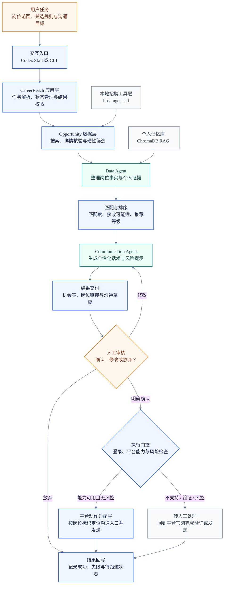
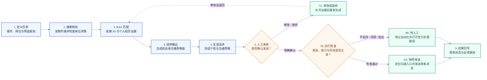

<div align="center">

# CareerReach AI

### 面向求职沟通场景的证据驱动型双 Agent 原型

把岗位信息、个人经历与历史沟通整理成可核验的证据，生成可供用户审核的沟通策略，并在用户明确确认后进入受控触达流程。


[查看演示](#完整演示从-prompt-到-excel) · [系统架构](#系统架构) · [工作流程](#端到端工作流程) · [技术实现](#技术实现) · [快速运行](#快速运行) · [Codex 交互](#在-codex-中使用) · [安全边界](#安全与隐私边界)

</div>

---

## 项目简介

CareerReach AI 是一个求职沟通 Agent 产品原型。系统先整理公司、岗位、简历和历史沟通中的事实，再基于证据生成沟通建议，并把信息缺口、引用依据和风险提示一起交给用户审核。

它关注的不是自动批量投递，而是三个更具体的问题：

- 如何把分散的岗位信息和个人经历整理成清晰的匹配依据；
- 如何让事实整理与话术生成由不同 Agent 分工完成；
- 如何在证据不足或动作敏感时停下来，请用户确认。

> **开源说明：** 本仓库是产品化展示与应用适配层。招聘平台本地工具、真实双 Agent 工作流、LangGraph 编排和 ChromaDB RAG 能力来自 MIT License 的第三方项目 [`boss-agent-cli`](https://github.com/can4hou6joeng4/boss-agent-cli)。本仓库不把第三方能力表述为完全自研。

## 完整演示：从 Prompt 到 Excel

下面展示一次完整的 Opportunity 工作流：用户用自然语言定义搜索城市、硬性筛选、RAG 匹配门槛、输出字段与沟通话术规则，Agent 将任务转化为结构化机会表。公开版使用 20 条脱敏演示记录，字段、筛选门槛和输出逻辑与 Prompt 对齐。

| 演示材料 | 内容 | 链接 |
| --- | --- | --- |
| 完整输入 | 可复用的 Opportunity 工作流 Prompt | [查看独立 Prompt 页面](careerreach-ai/examples/showcase/demo_input_prompt.md) |
| 浏览器预览 | 20 条候选结果与完整字段说明 | [查看输出预览](careerreach-ai/examples/showcase/demo_output_preview.md) |
| Excel 工作簿 | 19 个指定字段，可筛选、可继续编辑 | [下载公开演示 Excel](careerreach-ai/examples/showcase/careerreach_agent_output_public.xlsx) |

<details open>
<summary><strong>输入：AI 产品经理 Opportunity 工作流 Prompt</strong></summary>

```text
$boss-job-agent

请使用 boss-job-agent 的 opportunity 工作流，帮我生成一份 AI 产品经理机会表。

目标：
1. 在 BOSS 直聘搜索「AI产品经理」相关正式岗位，城市限定为上海和深圳。
2. 目标数量：20 个合格候选岗位。
3. 岗位本身可以是正式岗，但需要判断公司是否可能接受我以 AI 产品经理实习生身份先参与。

硬性筛选：
1. 排除实习岗：岗位名包含“实习/Intern/校招实习”等，或薪资为 100-500 元/天这类日薪。
2. 排除 1000 人以上公司；20-499 人优先；500-999 人可保留但降权。
3. 排除猎头、匿名公司及无法判断真实主体的岗位。
4. 排除已关闭岗位。
5. 排除实际工作地点不在上海或深圳的岗位。
6. 若 JD 将某项能力或工具列为硬性要求，而 RAG 记忆库中没有相关证据，则一票否决或进入待确认。
7. 对机器人/运动控制/ROS/机械臂、金融/投资/资金/对账、审美/视觉设计等缺少背景的方向明显降权。

匹配分析：
1. 调用本地 ChromaDB/RAG 记忆库，结合简历、项目经历、CareerReach Agent 搭建经历和历史补充记忆进行判断。
2. 重点匹配 AI 客服/ToB 场景、Dify 工作流、Agent 搭建和英语能力。
3. 简历匹配度低于 75，或实习接收可能性低于 48 的，不进入最终候选表。

输出 Excel：
字段必须包括：公司名、公司主要业务、公司规模、岗位名称、岗位需求判断、工作地点、薪资、一周实习几天、实习时长、简历匹配度、实习接收可能性、推荐等级、状态、匹配理由、风险/待确认、生成的打招呼话术、security_id、job_id、岗位网址。

话术要求：
1. 每个候选公司生成一段独立打招呼话术。
2. 说明话术由我自己搭建的 CareerReach Agent 基于 JD 和我的 RAG 记忆库生成。
3. 保持 bullet points、简洁、专业。
4. 如果匹配度低于 80，不显示具体分数，只说“匹配度较高”。
```

</details>

### 输出结果预览

下表展示 Excel 的核心信息层。实际工作簿还包含公司业务、公司规模、岗位需求判断、薪资、实习条件、风险项、状态、`security_id` 与 `job_id` 等字段。

| 公司名 | 岗位与地点 | 匹配度 | 实习接收可能性 | 推荐 | 生成的打招呼话术（精简展示） | 岗位链接 |
| --- | --- | ---: | ---: | --- | --- | --- |
| 星云智能 | AI 产品经理 · 上海 | 92 | 82 | A | 您好，我有 Agent 工作流与 AI 客服闭环经验，想了解是否可以先以 AI 产品经理实习生身份参与。 | [查看岗位](https://example.com/jobs/demo-001) |
| 海拓智联 | AI 客服产品经理 · 深圳 | 91 | 80 | A | 您好，我参与过保险 AI 客服方案与复杂业务流程设计，希望进一步了解团队当前的产品重点。 | [查看岗位](https://example.com/jobs/demo-002) |
| 知序科技 | Agent 产品经理 · 上海 | 90 | 80 | A | 您好，我搭建过 ChromaDB RAG 证据链与多 Agent 工作流，希望了解贵司知识库产品方向。 | [查看岗位](https://example.com/jobs/demo-003) |
| 北辰智服 | 智能客服产品经理 · 上海 | 89 | 66 | B | 您好，我有智能客服流程和 ToB 方案经验，想确认该岗位是否可以先以实习方式参与。 | [查看岗位](https://example.com/jobs/demo-004) |
| 矩阵工场 | Agent 平台产品经理 · 上海 | 88 | 72 | B | 您好，我实践过 LangGraph 编排、工具接入和输出校验，希望进一步沟通 Agent 平台规划。 | [查看岗位](https://example.com/jobs/demo-005) |
| 深蓝云策 | ToB AI 产品经理 · 深圳 | 88 | 74 | B | 您好，我有 ToB AI 方案与 Dify 工作流经验，希望了解岗位在需求分析与落地交付间的侧重点。 | [查看岗位](https://example.com/jobs/demo-006) |
| 前海知链 | RAG 产品经理 · 深圳 | 87 | 70 | B | 您好，我搭建过本地 ChromaDB 记忆库和可追溯证据链，希望了解贵司 RAG 产品当前阶段。 | [查看岗位](https://example.com/jobs/demo-007) |
| 远望数据 | AI 解决方案产品经理 · 上海 | 86 | 70 | B | 您好，我有数据工作流和企业 AI 方案经验，想了解该岗位偏产品方案还是工程交付。 | [查看岗位](https://example.com/jobs/demo-008) |
| 南山引擎 | Agent 产品经理 · 深圳 | 86 | 68 | B | 您好，我有双 Agent 编排、Dify 工作流和产品架构经验，希望进一步了解团队的 Agent 产品。 | [查看岗位](https://example.com/jobs/demo-009) |
| 云帆出海 | 海外 AI 产品经理 · 上海 | 85 | 69 | B | 您好，我具备英语能力和 Agent 产品实践，希望了解团队海外 AI 产品的核心使用场景。 | [查看岗位](https://example.com/jobs/demo-010) |
| 鹏城语智 | 多语言 AI 产品经理 · 深圳 | 84 | 66 | B | 您好，我有英语、AI 客服和 RAG 知识库经验，希望进一步了解多语言产品规划。 | [查看岗位](https://example.com/jobs/demo-011) |
| 光合互动 | AI 内容产品经理 · 上海 | 84 | 68 | B | 您好，我参与过数字人方案并搭建过 AIGC 内容工作流，希望了解团队的内容生产链路。 | [查看岗位](https://example.com/jobs/demo-012) |
| 智航协同 | AI 工作流产品经理 · 深圳 | 82 | 62 | B | 您好，我有 Dify 工作流和复杂流程拆解经验，希望了解贵司 AI 自动化产品方向。 | [查看岗位](https://example.com/jobs/demo-013) |
| 森罗创想 | AIGC 产品经理 · 上海 | 81 | 64 | B | 您好，我做过生成式内容工作流和产物质量控制，希望了解团队的创作者工具规划。 | [查看岗位](https://example.com/jobs/demo-014) |
| 云图科技 | AI 解决方案产品经理 · 深圳 | 80 | 60 | B | 您好，我有企业 AI 方案和数据工作流经验，希望进一步了解零售 AI 解决方案场景。 | [查看岗位](https://example.com/jobs/demo-015) |
| 星瀚互动 | 数字人产品经理 · 深圳 | 匹配度较高 | 56 | C | 您好，我参与过数字人整体方案和 AI 内容工作流设计，想了解岗位的产品职责与实习切入方式。 | [查看岗位](https://example.com/jobs/demo-016) |
| 灵犀教育 | AI 产品经理 · 上海 | 匹配度较高 | 58 | C | 您好，我有 Agent 工作流与 RAG 问答经验，希望了解这些能力在 AI 助教场景中的应用。 | [查看岗位](https://example.com/jobs/demo-017) |
| 拓维智能 | AI 产品经理 · 深圳 | 匹配度较高 | 50 | C | 您好，我搭建过 Agent 原型并完成需求到工作流的转化，想确认是否有实习转正通道。 | [查看岗位](https://example.com/jobs/demo-018) |
| 澄明科技 | 智能分析产品经理 · 上海 | 匹配度较高 | 52 | C | 您好，我有数据分析工作流和结构化报告输出经验，希望了解岗位中的 Agent 应用占比。 | [查看岗位](https://example.com/jobs/demo-019) |
| 岭南数创 | 企业 AI 产品经理 · 深圳 | 匹配度较高 | 48 | C | 您好，我有 ToB 方案、Dify 工作流和 Agent 项目经验，想确认是否可以先以实习方式参与。 | [查看岗位](https://example.com/jobs/demo-020) |

每段完整话术均由 CareerReach Agent 基于对应 JD 与本地 RAG 记忆库生成；上表为便于 README 阅读的精简展示。

**[查看 19 字段浏览器版输出](careerreach-ai/examples/showcase/demo_output_preview.md) · [下载完整 Excel 工作簿](careerreach-ai/examples/showcase/careerreach_agent_output_public.xlsx)**

> 公开版仅在这里统一说明：表格数据经过脱敏处理，岗位链接和平台标识使用演示占位值；本地真实运行时会在受控环境中保留对应岗位网址与定位标识。

## 核心能力

| 能力 | 系统做什么 | 用户得到什么 |
| --- | --- | --- |
| 岗位信息整理 | 汇总公司、JD、沟通目标和补充信息 | 一份结构清晰的岗位上下文 |
| 双 Agent 协作 | Data Agent 整理事实，Communication Agent 生成策略 | 事实与表达分开，便于检查 |
| RAG 证据检索 | 从公司、岗位、简历和沟通记录中召回相关内容 | 建议可以追溯到依据 |
| 多版本沟通建议 | 生成候选话术、跟进思路和行动建议 | 用户可以比较后再选择 |
| 信息缺口识别 | 主动标记缺失事实和不确定内容 | 避免把推测包装成事实 |
| 人工审核 | 敏感动作停在用户确认之前 | 用户保留最终决定权 |
| 受控触达 | 用户确认后检查登录、平台能力和风险信号，再定位对应招聘者并执行单条沟通 | 从分析结果进入可追踪的行动闭环 |
| 双 Backend | 公开演示模式与本地真实工作流使用同一输出规范 | 陌生环境可演示，本地环境可扩展 |

## 系统架构

下面的图展示从岗位发现、证据匹配、话术生成到人工确认和受控发送的完整系统链路。公开 Fixture Backend 停在审核阶段；完整本地 Backend 才会进入平台动作门控。



### 模块职责

| 模块 | 职责 |
| --- | --- |
| 交互入口 | 接收自然语言或结构化输入；Codex 是可选的自然语言客户端，不是系统内部的 Supervisor 节点 |
| CareerReach 应用层 | 解析任务、选择 Fixture 或本地 Backend、管理状态并校验结果 |
| Opportunity 数据层 | 搜索岗位、核验详情、执行硬性筛选并保留岗位定位信息 |
| LangGraph 工作流 | 按固定顺序执行 Data Agent 和 Communication Agent，并传递工作流状态 |
| Data Agent | 整理公司、岗位、个人经历和历史沟通，检索证据并标记缺失信息 |
| Communication Agent | 依据已整理的上下文生成候选话术、跟进建议、置信度和风险提示 |
| ChromaDB RAG | 在本地保存并检索公司、岗位、简历和沟通上下文 |
| 人工审核 | 用户确认目标岗位、核对证据并决定修改、放弃或执行 |
| 执行门控 | 在发送前检查登录状态、平台能力、重复触达与风控信号 |
| 平台动作适配层 | 在能力可用时根据 `security_id`、`job_id` 定位对应沟通入口并执行单条发送 |
| 结果回写 | 保存发送结果、失败原因与后续跟进状态；触发验证或风控时转人工 |

### 关于 Supervisor 与 Codex

当前版本**没有实现 Supervisor Agent**。

- 在 LangChain 的多 Agent 设计中，Supervisor 通常指一个能够根据对话状态动态选择和调用子 Agent 的中心 Agent。
- 当前真实工作流是由 LangGraph `StateGraph` 编排的固定双节点流程：Data Agent 完成事实整理后，再交给 Communication Agent。
- Codex 可以作为仓库外部的自然语言交互环境，通过 Skill 或 CLI 调用 CareerReach AI，并解释返回结果；它不是本项目 LangGraph 图中的 Supervisor，也不是被本地 CLI 直接调用的模型 API。

如果未来加入动态任务分派、循环重写或多个专业 Agent，再引入 Supervisor 模式会更合适。

## Agent 分工

### Data Agent

负责“把事实准备好”：

- 整理公司、岗位、沟通目标和用户补充信息；
- 从 ChromaDB 中检索相关公司、JD、简历和历史沟通证据；
- 为证据保留可追踪标识；
- 明确信息是否缺失；
- 不直接撰写沟通话术。

### Communication Agent

负责“基于事实给出沟通方案”：

- 生成不同表达风格的候选话术；
- 说明每个版本使用了哪些证据；
- 给出跟进建议、置信度和风险提示；
- 在信息不足时建议人工检查；
- 只负责生成与规划，不绕过 Human Review Gate 直接发送消息。

### Human Review Gate

它不是生成式 Agent，而是一条产品安全边界：

- **确认执行**：证据相对完整，用户核对草稿后可以明确授权执行单条沟通；
- **需检查**：信息不足或存在风险，需要用户补充或修改；
- **不建议继续**：当前条件下不建议触达。

用户确认不是跳过风险控制的授权。确认后系统仍会检查平台能力、登录状态、重复触达、账号风险和人工验证要求；只有检查通过才进入受控发送，否则停止自动化并转到官方页面人工处理。

### Controlled Action Executor

完整本地 Backend 可以在用户明确确认后调用平台动作能力：

1. 从候选记录读取 `security_id` 与 `job_id`，定位对应岗位和招聘者沟通入口；
2. 再次展示最终话术与目标岗位，接收用户的明确确认；
3. 检查平台是否支持 `greet`、登录态是否有效，以及是否出现重复触达或风险信号；
4. 条件通过时执行单条发送并回写结果；
5. 如果平台返回 `ACCOUNT_RISK`、`PLATFORM_VERIFICATION_REQUIRED`、`NOT_SUPPORTED` 或登录失效，则立即停止，保留上下文并转人工。

公开 Fixture Backend 和默认演示命令不会产生平台写操作。受控发送只属于已配置、已登录的本地真实 Backend，不包含批量触达，也不会尝试绕过平台验证或风控。

## 端到端工作流程

这张图从用户视角展示一次任务如何从搜索与匹配走到审核后触达，并明确异常情况下的停止路径。



真实双 Agent 的内容生成顺序是：

```text
START → Data Agent → Communication Agent → END
```

平台动作并不是 Communication Agent 的内部节点，而是发生在双 Agent 生成结束、用户审核通过之后：

```text
机会发现 → Data Agent → Communication Agent → Excel / 话术
→ Human Review Gate → Capability & Risk Check → 单条发送或转人工 → 状态回写
```

当 LangGraph 不可用时，内容生成工作流可以按相同顺序降级执行，并保持一致的输出结构。

## RAG 与证据链

RAG 的作用不是单纯增加上下文，而是让关键建议能够回到原始依据。

| 知识类型 | 典型内容 | 使用目的 |
| --- | --- | --- |
| 公司 | 业务方向、产品与行业信息 | 避免生成与公司无关的通用表达 |
| 岗位 | JD 职责、技能要求和岗位重点 | 判断岗位真正关注什么 |
| 简历 | 项目经历、职责、成果和技能 | 找到可以支撑沟通内容的个人证据 |
| 沟通 | 历史问题、回复和跟进状态 | 避免重复提问，保持对话连续 |

真实 Backend 可以使用 ChromaDB 的 `career_rag` collection 管理这些内容。召回的证据会进入 Agent 上下文，生成结果需要声明使用了哪些依据；当证据不足时，系统会优先提示人工补充。

公开 Fixture 模式只模拟相同的数据结构，不会声称真实启动了向量检索。

## 技术实现

### 技术栈

| 模块 | 技术 | 在项目中的作用 |
| --- | --- | --- |
| 应用后端 | Python 3.10+ | CLI、Backend 适配、结果校验和测试 |
| 命令入口 | `argparse` | 提供轻量、可复现的本地运行入口 |
| 本地工具层 | `boss-agent-cli` | 提供招聘场景数据能力与真实双 Agent 工作流 |
| Agent 编排 | LangGraph `StateGraph` | 串联 Data Agent 与 Communication Agent |
| RAG 数据库 | ChromaDB | 保存和检索公司、岗位、简历与沟通上下文 |
| 数据交换 | JSON | 统一输入输出协议，便于 CLI、Codex、MCP 或未来 Web 层接入 |
| 进程适配 | Python `subprocess` | 调用本地 CLI，并处理 Windows 中文编码兼容 |
| 输出校验 | Contract validator | 检查行动建议、草稿完整性和证据引用 |
| 隐私检查 | Redaction scan | 识别 Cookie、Token、会话和平台标识等敏感内容 |
| 测试与构建 | Pytest、Hatchling | 验证公开样例、输出契约和Python包构建 |
| 可选交互环境 | Codex + 仓库 Skill | 用自然语言调用CLI、阅读结果并协助用户判断 |

### 双 Backend

| Backend | 适用场景 | 是否需要外部依赖 | 数据 |
| --- | --- | --- | --- |
| `fixture`（默认） | GitHub 展示、快速体验和自动测试 | 不需要登录、模型服务或 ChromaDB | 合成数据 |
| `boss` | 本地集成验证与真实双 Agent 工作流 | 需要安装 `boss-agent-cli`；RAG 可选 | 用户本地上下文或本地知识库 |

两种模式返回相同的核心结构，让公开演示和本地工作流能够复用同一套上层处理逻辑。

## 输入与输出

### 输入示例

```json
{
  "company": "未来智能",
  "job_title": "AI 产品经理",
  "goal": "initial_outreach",
  "facts": {
    "company_business": "企业 AI 客服和 Agent 平台",
    "job_requirement_judgment": "RAG、Agent 工作流、ToB 需求分析",
    "resume_evidence": "AI 客服方案、Dify 工作流和 RAG Agent 实践"
  }
}
```

### 输出内容

系统返回的不是单独一句话，而是一份可审核的沟通决策结果，主要包括：

- 整理后的岗位上下文与可用证据；
- 当前缺失的信息；
- 多个候选沟通版本；
- 每个版本使用的证据；
- 跟进建议、置信度与风险提示；
- 建议采用、人工检查或停止的状态。

完整结构化样例见 [`examples/mock_agent_output.json`](careerreach-ai/examples/mock_agent_output.json)。

## 快速运行

默认运行 Fixture Backend。它只使用合成数据，不需要招聘平台登录、Cookie、外部模型或 ChromaDB。

### Windows PowerShell

```powershell
python -m venv .venv
.\.venv\Scripts\Activate.ps1
python -m pip install -e ".[dev]"
.\scripts\run-demo.ps1
```

### macOS / Linux

```bash
python3 -m venv .venv
source .venv/bin/activate
python -m pip install -e ".[dev]"
./scripts/run-demo.sh
```

也可以直接运行：

```bash
python -m careerreach_ai --input examples/mock_opportunity.json --pretty
```

### 使用本地真实 Backend

```bash
python -m pip install -e ".[boss]"
python -m careerreach_ai \
  --backend boss \
  --data-dir .tmp-demo-data \
  --input examples/mock_opportunity.json \
  --pretty
```

默认参数为 `rules + no-rag + no-save`，用于验证工作流与输出，不自动投递或发送消息。

本地 ChromaDB 配置完成后，可以显式开启 RAG：

```bash
python -m careerreach_ai \
  --backend boss \
  --use-rag \
  --data-dir .tmp-demo-data \
  --input examples/mock_opportunity.json \
  --pretty
```

## 在 Codex 中使用

Codex 是本仓库的一种可选交互方式。它可以读取自然语言任务，通过项目级 Skill 调用 CareerReach CLI，并把结构化结果解释给用户；核心双 Agent 工作流仍由本地 Backend 执行。

仓库 Skill 位于：

```text
.agents/skills/careerreach-ai/
├── SKILL.md
└── agents/
    └── openai.yaml
```

示例：

```text
$careerreach-ai 用公开样例运行一次 Demo，说明系统使用了哪些证据，
并在任何发送动作前停下来让我确认。
```

也可以查看 [`examples/codex_conversation_prompt.md`](careerreach-ai/examples/codex_conversation_prompt.md)。

## 测试

```bash
python -m pytest -q
```

测试覆盖：

- Fixture Backend 是否符合统一输出契约；
- 本地 Backend 是否使用安全默认参数；
- 证据引用能否映射回上下文；
- 公开样例是否包含敏感标记；
- README、Skill、架构说明与运行时术语是否保持一致。

## 仓库结构

```text
careerreach-ai/
├── .agents/skills/careerreach-ai/   # Codex 项目级 Skill
├── src/careerreach_ai/              # 应用后端与 Backend 适配
├── examples/
│   ├── mock_opportunity.json        # 合成输入
│   ├── mock_agent_output.json       # 结构化输出
│   └── showcase/                    # 可点击的 Prompt 与表格展示
├── docs/                            # 架构、产品和安全补充说明
├── scripts/                         # Windows / macOS / Linux 运行脚本
├── tests/                           # 契约与安全测试
├── pyproject.toml
├── THIRD_PARTY_NOTICES.md
└── README.md
```

## 当前实现边界

### 本仓库已实现

- 可直接运行的 Fixture Backend；
- `boss-agent-cli` Backend 适配器；
- 统一输入输出契约与结果校验；
- Windows 中文输出兼容；
- 敏感标记扫描、测试和跨平台脚本；
- 公开演示文档、Codex Skill 与脱敏展示材料。

### 依赖第三方 `boss-agent-cli`

- Data Agent 与 Communication Agent 的真实工作流；
- LangGraph 编排与顺序降级；
- ChromaDB RAG 读写和求职上下文管理；
- 招聘平台本地数据与相关 CLI 能力；
- 在平台支持、登录有效、风险检查通过且用户明确确认后的单条 `greet` 等受控动作能力。

### 当前不包含

- 独立 Web 前端或在线托管服务；
- 当前版本的 Supervisor Agent；
- 未经用户确认的自动发送、批量触达、自动交换联系方式或绕过平台风控的动作；
- 真实账号凭证、简历、聊天记录、岗位标识或向量数据库；
- 面向生产环境的多租户、权限、监控和云部署能力。

## 安全与隐私边界

公开仓库只允许合成或充分脱敏的数据。以下内容不得提交：

- Cookie、Token、加密 Session、登录二维码或浏览器用户目录；
- 真实简历、招聘者消息、联系方式和沟通记录；
- 真实 `job_id`、`security_id`、`contact_id` 或含这些字段的平台导出表；
- 本地 ChromaDB 持久化目录和真实向量数据；
- `.env`、私钥或模型 Provider 密钥。

Agent 可以整理事实、检索证据和生成建议，但任何平台写操作、投递、回复、联系方式交换或验证流程都需要用户明确确认。系统不会尝试绕过平台登录、验证、风控或账号限制。

## 第三方开源说明

本项目的本地招聘工具层与真实双 Agent 工作流基于 MIT License 的开源项目 [`boss-agent-cli`](https://github.com/can4hou6joeng4/boss-agent-cli)。详细归属与许可证说明见 [`THIRD_PARTY_NOTICES.md`](careerreach-ai/THIRD_PARTY_NOTICES.md)。

## License

本展示仓库采用 [MIT License](careerreach-ai/LICENSE)。第三方组件继续遵循其各自许可证。

---

<div align="center">

**CareerReach AI — 用可核验的证据支持每一次求职沟通。**

</div>
