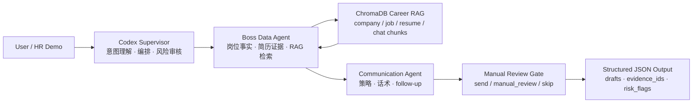

<div align="center">

# CareerReach AI

一个面向 AI 产品经理求职场景的双 Agent 协作原型：把岗位事实、个人经历和沟通策略串成可追溯的证据链。


</div>

## 功能

CareerReach AI 展示的是一个「求职沟通 Agent」的产品化封装。它基于第三方开源项目 [`boss-agent-cli`](https://github.com/can4hou6joeng4/boss-agent-cli) 的本地工具能力，在 Codex 中设计了一个更适合自然语言协作的 Agent 工作流：用户只需要说出目标岗位或沟通意图，Agent 会整理岗位事实、检索个人经历证据、生成沟通策略，并在风险不充分时给出 `manual_review`，而不是直接自动触达。

我在这个 demo 中重点呈现：

- 双 Agent 分工：`Boss Data Agent` 负责事实收集和 RAG 证据，`Communication Agent` 负责沟通策略、话术和 follow-up。
- Supervisor 审核：Codex 作为上层编排者，负责意图理解、命令选择、结果解释和风险闸门。
- RAG 证据链：以 ChromaDB 承载公司、岗位、简历和聊天上下文，输出保留 `evidence_ids`，避免无依据生成。
- 可降级执行：优先使用 LangGraph 编排，缺失运行时可以降级到 sequential fallback，保证 demo 可跑。
- 合规边界：不自动发送消息、不批量触达、不上传真实岗位或账号数据，敏感动作全部停在人工确认前。

## 工作流



## 快速运行

默认 demo 使用合成样例数据，不需要 BOSS 登录、不需要真实 Cookie，也不需要启动 ChromaDB。

```powershell
python -m venv .venv
.\.venv\Scripts\Activate.ps1
pip install -e ".[dev]"
.\scripts\run-demo.ps1
```

也可以直接用 Python 运行：

```powershell
python -m careerreach_ai --input examples\mock_opportunity.json --pretty
```

输出会包含：

```json
{
  "ok": true,
  "command": "careerreach ai demo",
  "data": {
    "plan": {
      "recommended_action": "send",
      "confidence": 0.79,
      "evidence_ids": ["company:demo", "job:demo", "resume:demo"]
    }
  }
}
```

## 接入真实 CLI

如果本机已安装 `boss-agent-cli`，可以切到真实 backend。这个模式仍然默认使用 `--no-rag --no-save --mode rules`，方便快速演示，不触发平台请求。

```powershell
pip install -e ".[boss]"
python -m careerreach_ai --backend boss --data-dir .tmp-demo-data --input examples\mock_opportunity.json --pretty
```

真实 RAG 模式可以在本地 ChromaDB 可用后开启：

```powershell
python -m careerreach_ai --backend boss --use-rag --data-dir .tmp-demo-data --input examples\mock_opportunity.json --pretty
```

## 技术栈

| 层级 | 设计 |
| --- | --- |
| Supervisor | Codex 负责自然语言理解、工具选择、输出解释和 human-in-the-loop 风控 |
| Tool Layer | 基于 `boss-agent-cli` 的 JSON command envelope，便于被 Agent 稳定调用 |
| Data Agent | 抽取公司、岗位、简历、聊天上下文，形成结构化 `OpportunityContext` |
| RAG | ChromaDB 存储 career context，检索结果保留 `chunk_id` 作为 `evidence_id` |
| Workflow | LangGraph 双节点编排：`boss_data_agent -> communication_agent`，支持 fallback |
| Safety | `manual_review` 风险闸门，敏感平台动作由用户在官方界面确认 |

## 仓库结构

```text
.
├── src/careerreach_ai/           # 展示用 wrapper、fixture backend、CLI backend adapter
├── examples/                     # 合成岗位样例和 demo 输出
├── docs/                         # 架构、产品设计和安全边界
├── scripts/                      # Windows/macOS/Linux 快速运行脚本
├── tests/                        # 合同测试与敏感信息检查
├── THIRD_PARTY_NOTICES.md        # 第三方开源说明
└── README.md                     # GitHub 首页展示
```

## 展示口径

这个 demo 不是一个「自动投递工具」，而是一个求职场景下的 Agent 产品原型。它的核心价值在于：把信息收集、证据检索、沟通生成和人工审核放在同一条链路里，让 AI 在提高效率的同时保留可解释性和边界感。

第三方工具说明：底层 BOSS/招聘平台本地 CLI 能力来自开源项目 `boss-agent-cli`。本仓库主要展示我对该能力的产品化封装、Agent 编排、RAG 证据链设计、风险控制和 GitHub demo 化整理。
